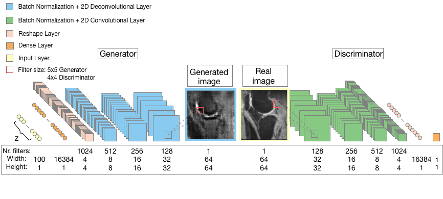
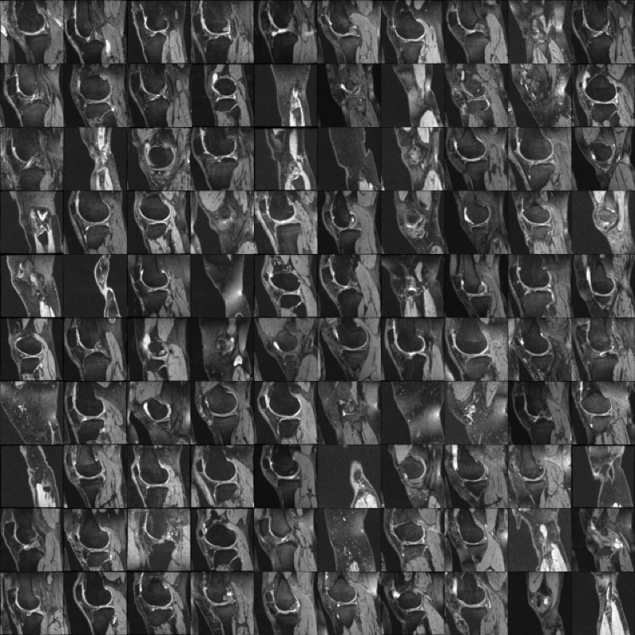
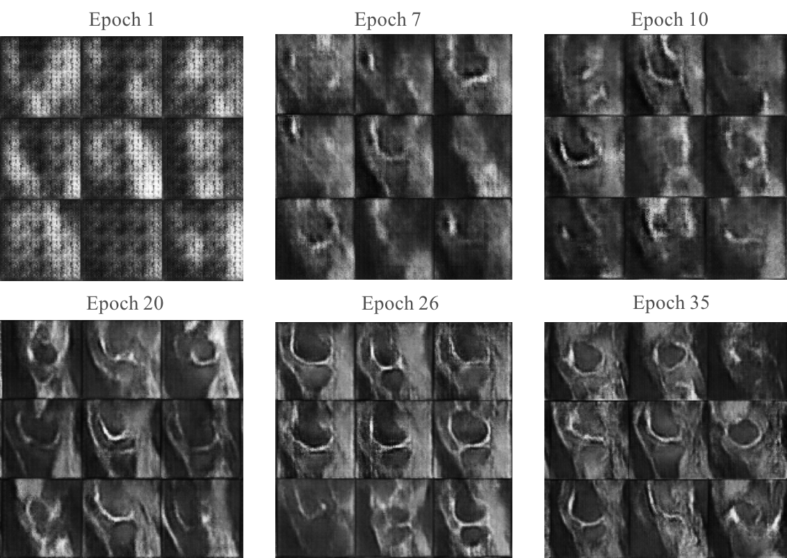

# Improved Wasserstein GAN (WGAN-GP) application on MRI dataset

Application of a deep generative adversarial network on MRI images of knees. The MRI database used was provided by Imperial College London, however similar databases can be found on the OAI website (http://www.oai.ucsf.edu/), an observational study dedicated to monitor the natural evolution of osteoarthritis.
The dataset used in this project was comprised of 28800 2D black&white MRI images of size 64x64.
# Prerequisites
- Python, Lasagne (developer version), Theano (developer version), Numpy, Matplotlib, scikit-image
- NVIDIA GPU (5.0 or above)
# Architecture

 
# Results

The hyperparameters used were:
- a learning rate of 0.0005
- a decay rate of 0.5
- a batch size of 128 images
- a z space of 200

The network was trained using 35 epochs (~7800 iterations)

- **Examples of real images from the input dataset** 

- **Examples of generated images 7800 iterations**

- **Evolution of generated images at various iterations (total of 35 epochs - around 7800 iterations)**

# License
This project is licensed under Imperial College London.
# Acknowledgements
The following codes were used as a base:
- for the main skeleton for a lasagne implementation of an adversarial generative network: https://github.com/ToniCreswell/AllThingsGAN/blob/master/Code/dcgan.py 
- for WGAN-GP implementations
 https://github.com/tjwei/GANotebooks and
 https://github.com/igul222/improved_wgan_training

